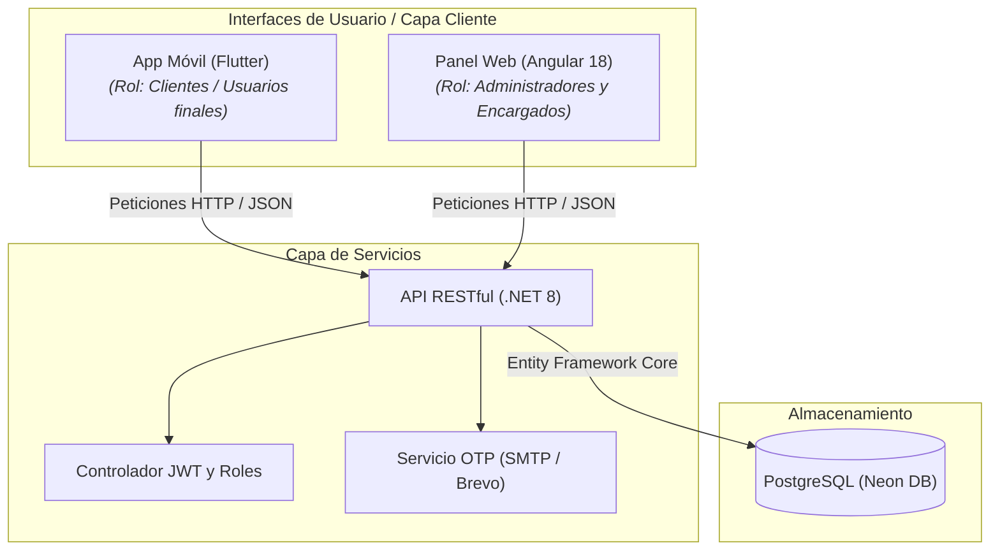

# Gestión de Créditos y Comercio


Sistema multiplataforma diseñado para la administración descentralizada de solicitudes de crédito, verificación de identidad en dos pasos, gestión de tiendas y seguimiento de cobranza en tiempo real.

## Arquitectura del sistema

La solución adopta una arquitectura desacoplada basada en microservicios ligeros e interfaces cliente-servidor especializadas por rol.



## Componentes principales

- **API RESTful (.NET 8):** Capa de backend encargada del procesamiento de negocio, encriptación de credenciales mediante BCrypt, validación de esquemas de datos y generación de tokens de autenticación JWT.
- **Panel web administrativo (Angular 18):** Interfaz exclusiva para **administradores y encargados de tienda** que permite la gestión de créditos, consulta de inventarios, aprobación de usuarios y emisión de reportes financieros.
- **Cliente móvil (Flutter 3.x):** Aplicación orientada exclusivamente a **clientes (usuarios finales)** que soporta flujos de registro multipaso, verificación de OTP por correo electrónico, solicitud de créditos y monitoreo de cuotas de pago.
- **Persistencia distribuida (PostgreSQL en Neon):** Base de datos relacional alojada en la nube con soporte de migraciones automáticas mediante Entity Framework Core 8.

## Lógica de negocio y reglas del sistema

| Módulo | Endpoint / Componente | Regla de negocio / Flujo crítico |
|---|---|---|
| Autenticación | `POST /api/Usuario/Login` | Validación de credenciales con hash BCrypt y emisión de token JWT según rol (Administrador, Encargado, Cliente). |
| Verificación OTP | `POST /api/EmailValidation/EnviarCodigo` | Emisión de código numérico de 6 dígitos con tiempo de expiración en UTC de 5 minutos. |
| Gestión de tiendas | `UsuarioRepository.crearUsuario` | Verificación e inserción dinámica de tiendas al registrar encargados si la cédula no existe previamente. |
| Registro multipaso | `register_screen.dart` | Flujo secuencial cliente de captura de datos personales, tienda asociada, verificación de correo y condiciones de crédito. |
| Cobranza | `pagos-component` | Consulta de saldos adeudados por parte del administrador, cálculo de cuotas pendientes y registro de amortizaciones. |

## Estructura del repositorio

```text
.
├── ApiCredito2-main/                   # Proyecto Backend (.NET 8 Web API)
│   ├── GestionIntApi/                  # Código fuente de controladores, modelos y repositorios
│   │   ├── Controllers/               # Endpoints REST para autenticación, crédito y pagos
│   │   ├── Models/                    # Entidades del DbContext y DTOs
│   │   ├── Repositorios/              # Capa de acceso a datos y lógica de negocio
│   │   └── appsettings.json           # Configuración base de la aplicación
│   └── Dockerfile                      # Archivo de construcción multietapa para Docker
├── CellCompanyFrontend-VersionFinal/   # Proyecto Frontend Web (Angular 18 - Admins y Encargados)
│   ├── src/app/                        # Componentes, servicios, modelos e interfaces Angular
│   ├── angular.json                    # Configuración de compilación del CLI de Angular
│   └── netlify.toml                    # Configuración de despliegue continuo en Netlify
├── AppMovilGestionCreditos1/           # Proyecto Aplicación Móvil (Flutter - Clientes)
│   ├── lib/presentation/               # Pantallas UI, componentes y navegación del cliente
│   └── pubspec.yaml                    # Gestión de dependencias y paquetes de Flutter
└── .gitignore                          # Exclusiones globales del repositorio
```

## Instalación y ejecución local

### Requisitos previos

- **.NET SDK 8.0** o superior.
- **Node.js 18+** y Angular CLI instalados globalmente.
- **Flutter SDK 3.x** configurado con Android Studio / Emulator.

### Configuración del backend

```bash
cd ApiCredito2-main/GestionIntApi
dotnet restore
dotnet run
```

### Configuración del frontend web (Administradores y Encargados)

```bash
cd CellCompanyFrontend-VersionFinal
npm install
ng serve
```

### Configuración de la aplicación móvil (Clientes)

```bash
cd AppMovilGestionCreditos1
flutter pub get
flutter run
```
