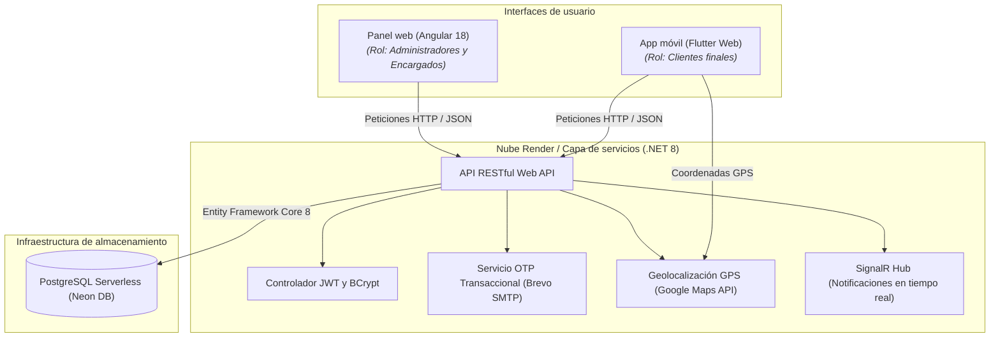

# Gestión de Créditos y Comercio 📱


Sistema multiplataforma diseñado para la administración descentralizada de solicitudes de crédito, verificación de identidad en dos pasos, seguimiento de cobranza en tiempo real y gestión logística de inventarios entre bodegas y tiendas asociadas.

## Disponibilidad y demostración

- **Aplicación móvil (Flutter Web):** [https://luisknight24.github.io/GestionCreditos-Completo/](https://luisknight24.github.io/GestionCreditos-Completo/)

## Arquitectura del sistema

La solución adopta una arquitectura desacoplada basada en microservicios ligeros, alojamiento en la nube (Render) e interfaces cliente-servidor especializadas por rol.


```mermaid
graph TD
    subgraph "Interfaces de usuario"
        A["App móvil (Flutter Web)<br/><i>(Rol: Clientes finales)</i>"]
        B["Panel web (Angular 18)<br/><i>(Rol: Administradores y Encargados)</i>"]
    end

    subgraph "Nube Render / Capa de servicios (.NET 8)"
        C["API RESTful Web API"]
        D["Controlador JWT y BCrypt"]
        E["Servicio OTP Transaccional (Brevo SMTP)"]
        G["Geolocalización GPS (Google Maps API)"]
        H["SignalR Hub (Notificaciones en tiempo real)"]
    end

    subgraph "Infraestructura de almacenamiento"
        F[("PostgreSQL Serverless (Neon DB)")]
    end

    A -->|Peticiones HTTP / JSON| C
    B -->|Peticiones HTTP / JSON| C
    A -->|Coordenadas GPS| G
    C --> D
    C --> E
    C --> G
    C --> H
    C -->|Entity Framework Core 8| F
```

## Componentes principales

- **API RESTful (.NET 8 en Render):** Capa de backend desplegada en la nube Render encargada del procesamiento de negocio, encriptación de credenciales mediante BCrypt, validación de esquemas de datos, generación de tokens JWT y comunicación en tiempo real con SignalR.
- **Servidor transaccional OTP (Brevo SMTP):** Servicio de pasarela de correo encargado del despacho de códigos de verificación numéricos de 6 dígitos para la validación de cuentas e intentos de recuperación de contraseña.
- **Panel web administrativo (Angular 18):** Interfaz exclusiva para administradores y encargados de tienda que permite la gestión de créditos, monitoreo de pagos, control de bodega, traslados entre tiendas y emisión de reportes financieros.
- **Cliente móvil (Flutter 3.x):** Aplicación orientada a clientes finales desplegada en GitHub Pages que soporta flujos de registro multipaso guiados en tienda, verificación de OTP por correo electrónico, monitoreo de cuotas y notificaciones de cobranza.
- **Persistencia distribuida (PostgreSQL en Neon DB):** Base de datos relacional alojada en la nube serverless de AWS con soporte de migraciones automáticas mediante Entity Framework Core 8.

## Módulos y flujos de la aplicación móvil

| Sección / Pantalla | Descripción y reglas de negocio |
|---|---|
| Registro - Sección 1: Información básica | Captura el nombre completo, correo electrónico y contraseña del usuario para la creación inicial de la cuenta. |
| Registro - Sección 2: Datos del cliente | Recopila los datos de identificación personal incluyendo número de cédula, teléfono de contacto y dirección domiciliaria. |
| Registro - Sección 3: Datos de la tienda | Requiere ingresar la cédula del encargado de la tienda receptora y el estado de comisión. Esta cédula se valida al completar el registro e impide la creación de la cuenta si no coincide, garantizando seguridad en los registros guiados en tienda. |
| Registro - Sección 4: Configuración de venta | Permite seleccionar la modalidad de compra entre contado y crédito. En venta a contado se ingresa únicamente el valor total; en venta a crédito se especifica el propietario del crédito (permitiendo asociar el crédito a un familiar aunque la cuenta sea del titular), tipo de producto (televisores o teléfonos), marca, modelo, capacidad, IMEI, precio, entrada, cuotas, frecuencia (semanal, quincenal, mensual) y fecha de inicio de pago. Al completar el formulario se despliega una calculadora visual con el monto total e individual de las cuotas y se envía un código OTP al correo para validar la cuenta. |
| Autenticación y recuperación | Permite iniciar sesión y recuperar la contraseña en caso de olvido mediante la emisión de un código OTP enviado por correo vía Brevo SMTP para autorizar el cambio. |
| Panel del crédito (Dashboard) | Muestra una tarjeta principal con los detalles del crédito activo incluyendo fecha de venta, dispositivo, cuotas pagadas/pendientes, valor de la cuota, fecha del próximo pago y una barra de progreso visual de amortización. |
| Historial de pagos | Lista los abonados realizados y las cuotas pendientes con sus fechas de vencimiento. El estado se actualiza en tiempo real al momento que el administrador registra una amortización en el sistema de gestión. |
| Notificaciones | Emite alertas automáticas al cliente cuando faltan 5 días, 3 días y el mismo día de pago, así como avisos de mora o confirmaciones de recepciones de pago. |
| Solicitud de nuevo crédito | Permite solicitar una nueva financiación únicamente tras liquidar al 100% el crédito vigente. Requiere la autorización presencial de la tienda para reiniciar el proceso de registro. |

## Módulos del panel administrativo web

| Sección del panel | Descripción técnica y capacidades |
|---|---|
| Autenticación | Recuperación de contraseña mediante código OTP enviado al correo. No posee registro público; el sistema se entrega con una cuenta administrativa maestra desde la cual se crean los demás usuarios delegados. |
| Dashboard | Muestra las métricas comerciales principales del negocio incluyendo total financiado, total recaudado, saldo pendiente, evolución de créditos otorgados, rendimiento comercial y composición de cartera. |
| Usuarios admin | Registra usuarios habilitados para ingresar al panel web, permitiendo asignar roles y activar o deshabilitar accesos. |
| Registro app móvil | Visualiza la información de los créditos asociados a clientes registrados en la app móvil. Permite modificar datos, eliminar registros o crear créditos directamente desde el panel según sea necesario. |
| Pagos | Procesa amortizaciones en ventanilla o transferencia. Incluye vista de calendario con fechas de vencimiento, formulario de pago con cálculo automático de saldos y emisión de factura digital, historial de transacciones, opción de segundo crédito excepcional y eliminación de créditos. |
| Ubicación | Registra la posición geográfica de los dispositivos mediante coordenadas en Google Maps. Esta funcionalidad es crítica para prevenir pérdidas, desconexiones o siniestros en equipos financiados. |
| Registrar bodega | Controla el ingreso de productos a bodega central. Permite consultar el historial técnico de entrada, gestionar traslados de dispositivos hacia tiendas asociadas y eliminar registros. |
| Editar bodega | Permite modificar precios y detalles técnicos de productos en bodega. Esta opción está restringida exclusivamente al rol Administrador, impidiendo que los delegados editen datos previamente registrados. |
| Registrar tienda | Administra los puntos de venta a los que se distribuyen dispositivos. Permite crear, editar información de contacto o eliminar tiendas asociadas. |
| Movimientos | Visualiza el flujo de mercadería entre sucursales. Permite seleccionar una tienda (ej. CellComPay Quicentro Norte), revisar el historial de traslados de sus productos y reubicar unidades hacia otras sucursales o de retorno a bodega. |
| Reportes | Almacena el historial global de créditos del sistema. Permite generar reportes financieros consolidados o filtrados por rangos de fecha. |

## Estructura del repositorio

```text
.
├── ApiCredito2-main/                   # Proyecto Backend (.NET 8 Web API)
│   ├── GestionIntApi/                  # Controlador, repositorios y modelos C#
│   │   ├── Controllers/               # Endpoints REST de autenticación, pagos y créditos
│   │   ├── DTO/                       # Objetos de transferencia de datos
│   │   ├── Models/                    # Entidades de base de datos EF Core
│   │   └── Repositorios/              # Capa de lógica de negocio y persistencia
│   └── Dockerfile                      # Contenedor de despliegue multietapa
├── CellCompanyFrontend-VersionFinal/   # Proyecto Panel Web (Angular 18)
│   ├── src/app/                        # Componentes, interceptores JWT y guardias de ruta
│   └── angular.json                    # Configuración del CLI de Angular
├── AppMovilGestionCreditos1/           # Proyecto Aplicación Móvil (Flutter 3.x)
│   ├── lib/presentation/               # Vistas UI, registro multipaso y dashboard
│   └── pubspec.yaml                    # Dependencias de Flutter
└── README.md                           # Documentación principal del sistema
```

## Instalación y ejecución local

### Requisitos previos

- **.NET SDK 8.0** o superior.
- **Node.js 18+** y Angular CLI instalados globalmente.
- **Flutter SDK 3.x** configurado con emulador Android o soporte Web.

### Ejecución del backend (.NET 8)

```bash
cd ApiCredito2-main/GestionIntApi
dotnet restore
dotnet run
```

### Ejecución del panel web (Angular 18)

```bash
cd CellCompanyFrontend-VersionFinal
npm install --legacy-peer-deps
npx ng serve
```

### Ejecución de la aplicación móvil (Flutter)

```bash
cd AppMovilGestionCreditos1
flutter pub get
flutter run -d chrome
```
